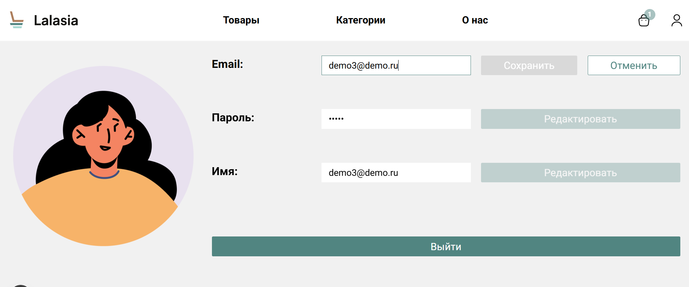
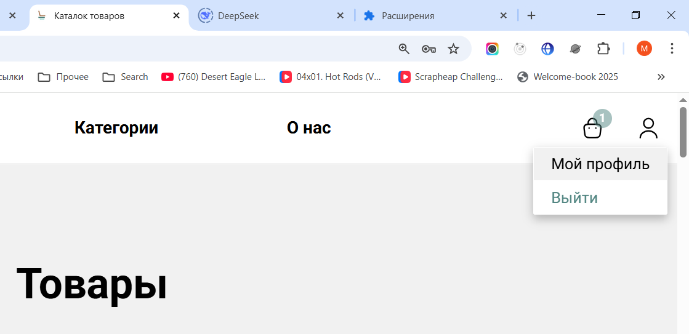

# 🛍️ Lalasia - онлайн-магазин  

[Ссылка на репозиторий с оригинальным проектом:](https://github.com/MaxKrch/next-commerce)  
  
  
## 🚀 Как установить  
  
  
*Страница профиля*
  
### Основные команды
`yarn install`   # Установка зависимостей  
`yarn dev`       # Запуск проекта в dev-режиме (с Turbopack)  
`yarn build`     # Сборка проекта для деплоя  
  
### Настройка окружения  
После установки создайте файл .env в корне проекта и укажите в нём:  
`NEXT_PUBLIC_API_BASE_URL = https://api.escuelajs.co/api/v1`  
  
  
  
### Ссылки  
**Продакшен:**   https://platzi-store-commerce.vercel.app/  
**Репозиторий:** https://github.com/MaxKrch/platzi-store-commerce  

### 🧩 О проекте
Большая часть функционала повторяет функционал оригинального проекта.
Со списком функций и структурой можно познакогмиться на его странице -  
[Ссылка на репозиторий с оригинальным проектом:](https://github.com/MaxKrch/next-commerce)  
  
  
*Когда пользователь авторизован - вместо формы входа отображается попап*  
  
### 🧱 Что добавлено в проекте
* **Новый API** - проект переписан на новый API, изменены endpoints  
* **Серверная авторизация** - добавлена авторизация на сервере Next, refresh токен хранится толкьо в куках, access токен - в памяти приложения  
* **Локальная корзина** - корзина хранится в LocalStorage, синхронизация с сервером убрана (ограничение API)  
* **Редактируемая страница профиля** - вместо модального окна добавлена полноценная страница пользователя с возможностью редактировать данные  
* **Попап с меню пользователя** - добавлен попап со своим стором и компонентом-порталом    
* **Поиск и фильтры** - добавлен фильтр по цене, урезан фильтр категорий и сортировка на сервере (ограничение API)   
* **Проверка доступности email** - добавлена проверка доступности email на сервере, с debounce и защитой от гонки запросов  
* **Очередь запросов** -  если какой-то запрос вернул 401 статус, запросы, требующий авторизации, добавляются в очередь на время обновления токена  
* **Запросы и обновление токенов** - добавлен класс для управленяи запросами и обновления токенов    

  

